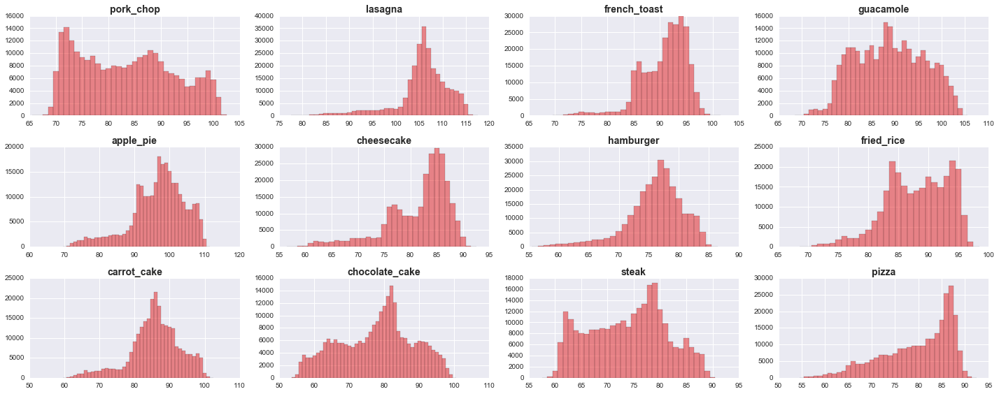
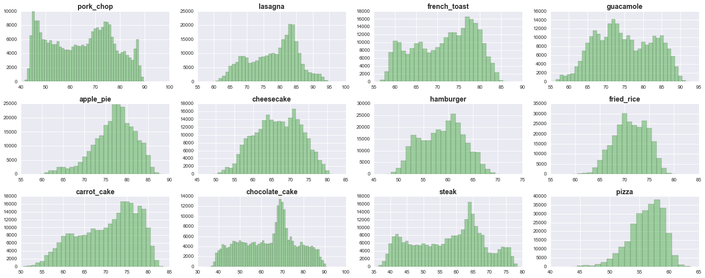
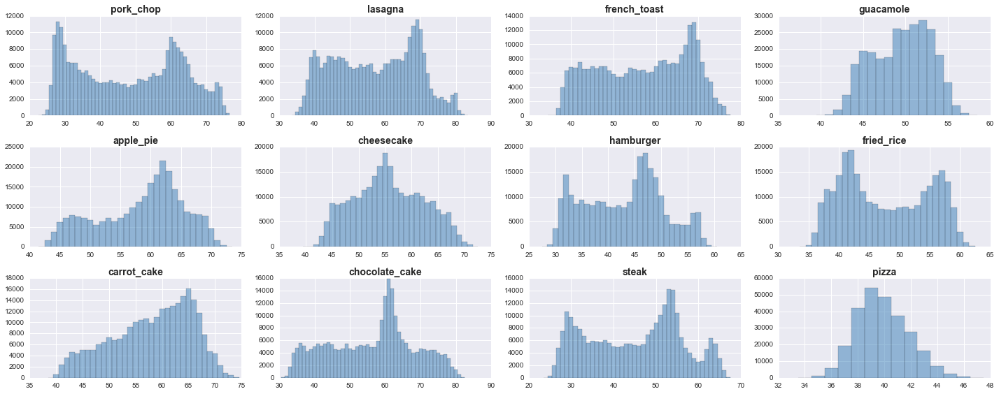
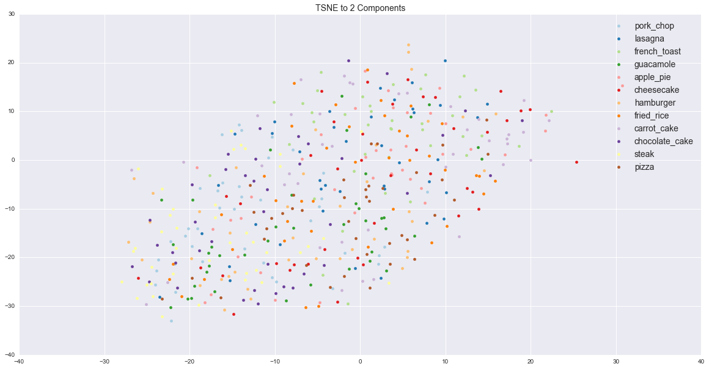
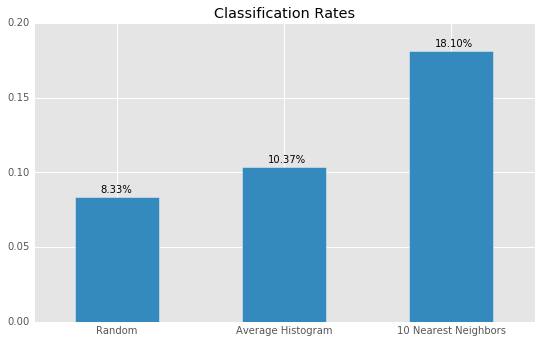

## Food Image Recognition Capstone Project Update

### Project Context

- Company X is a leading food publisher with a large online and offline presence
- They are responsible for publishing a large number of recipe books in different languages across the world, and they also have a popular online presence with a website containing thousands of recipes across multiple cuisines
- Company X is working on producing a next generation recipe management app for smartphones.
- A key feature that they wish to ship is the ability to for users to be able to identify dishes and the associated recipes simply by using the camera on their device, or by uploading a photo of the dish in question.
- However, Company X does not have computer vision expertise in-house and they need assistance in identifying and training a machine learning algorithm capable of recognising and identifying dishes with a sufficient level of accuracy for this feature to be useful to their users.
- This feature is currently considered “exploratory” by Company X, and as such they are not able to invest significant amounts of money in a large team or dedicated hardware

### Key Question / Problem Statement

Is it possible to train a machine learner capable of distinguishing between and identifying individual dishes from a photo, while minimising the initial cost of external resources such as computing power?

### Data Sources

1. Food 101
    - 101 Categories, 1000 images per category (750 training + 250 test)
    - Source: EETHZ Vision Lab (http://www.vision.ee.ethz.ch/datasets_extra/food-101/)
2. Menu-Match Dataset
    - 646 images, 1,386 tagged food items across 41 categories
    - Source: Microsoft Research
(http://research.microsoft.com/en-us/um/redmond/projects/menumatch/data/)
3. UNICT FD889
    - 889 Distinct plates of food
    - Source: University of Catania (http://iplab.dmi.unict.it/UNICT-FD889/)
4. UEC FOOD 100
    - 100 categories of food images (mainly Japanese); Each category contains approx. 100 images
    - Source: http://foodcam.mobi/dataset100.html

### Initial Data Exploration: Dataset 2

I started with the Menu-Match Dataset from Microsoft Research.

This dataset includes 646 images across 42 different categories, however most images are tagged with multiple categories, including up to four categories for some images.

Additionally, there are recurring themes across categories, for instance the top 5 categories for labels 1, 2,3 and 4 are:

Label 1 | Label 2 | Label 3 | Label 4
--------| --------| --------| --------
Brown Rice | Panang Curry Chicken | Spicy String Beans | Vegetable Spring Roll
Jasmine Rice | Orange Chicken | Panang Curry Chicken | Yellow Curry with Chicken
Cheese Pizza | Pepperoni Pizza | Yellow Curry with Chicken | Stir-fry Beef
Bread Sticks | Potato Bread | Stir-fry Beef | Spinach Red Curry with Tofu
Pineapple Pizza | Jasmine Rice | Vegetable Spring Roll | 

My first approach was to group labels into Super Categories, such as:

- Pizza
- Chicken
- Rice
- Soup
- Lasagne
- Salad
- Bread

However ultimately I decided not to continue to use this particular dataset for a number of reasons:

- Different categories applying to the same image (out of 646 images, only 106 have just one label)
- Unequal numbers of images per category
- Overall quite a small dataset
- The images are not standardized (there are 41 different image sizes)

### Initial Data Exploration: Dataset 1

I moved on to using the Food 101 Dataset from the EETHZ Vision Lab.

This is a ~5GB dataset with 101,000 images in total across 101 separate classes (each class having exactly 1000 images).
All images are in jpg format, and have been rescaled to have a maximum side length of 512 pixels.

Given the size of the dataset and the associated challenges with processing such large quanitities of information, I decided to reduce the size of the dataset and decided to prioritize image classes based upon the most popular recipe search terms on Google.

I downloaded from Google AdWords Tools the most popular recipe-related search terms in the USA in 2015, and then compared the search terms to the classes in the dataset; of the top 100 search terms, there was a direct match with 13 classes in the Food 101 dataset.

Going forward, I am focusing on the top 12 matching classes which are:

- Pork chop
- Lasagna
- French toast
- Guacamole
- Apple pie
- Cheesecake
- Hamburger
- Fried rice
- Carrot cake
- Chocolate cake
- Steak
- Pizza

### Exploration of the Top 12 Image Classes

One of the first things I did was to standardize all of the images for the top 12 classes by rotating them to the same orientation and scaling to a common size.

Of the 12,000 images, 60% have size (512, 512, 3) and this is the standard size that I will use going forward.

#### Histograms

The next step was to compare RGB histograms for these classes by:

1. Calculate an average image for each class across pixel values
2. Calculate and plot the histograms for Red, Green and Blue respectively

For the twelve classes these look like:

**Red Histograms**

**Green Histograms**

**Blue Histograms**

We can see that there is clear variation between color distributions across the average images for each class.

#### 2 Dimensions

Next I tried plotting the different classes in 2-Dimensions according to the following pseudocode:

- Find the 40 'closest' images to the average for each class
- Reduce images to 50 dimensions using PCA
- Further reduce to 2 dimensions using TSNE

**2-D Representation**

From the plot we cannot see any clear patterns or groupings for the different classes.

#### Pre-trained Model

Finally I ran a pre-trained model on 10 images from each class. The model comes from Andrej Karpathy (https://github.com/karpathy/neuraltalk).

The results were mixed. In most cases the model was able to identify that the image was of some type of food and the general classification was of the form:

    A plate of *item of food* with a fork / other food item

The classes with the most successful predictions were:

- Cheesecake
- Carrot Cake
- Chocolate Cake
- Pizza

### Histogram classifier

After the initial analysis and exploration, I moved on to classification techniques.

I started with a very basic model based upon the histogram for the average image in each class, using three different distance metrics for comparison:

1. Histogram Intersection
2. L1 Norm
3. Euclidean Distance

Furthermore, I constructed the model histogram three different ways:

- Greyscale only
- RGB
- RGB + Greyscale

The results were:

Histogram Type| Intersection | L1 Norm | Euclidean 
--------------|:------------:|:-------:|:---------:
Greyscale Only | 9.07% | 9.07% | 9.50%
RGB | 10.30% | 10.30% | 10.20%
RGB + Greyscale | 10.37% | 10.37% | 9.90%

In general, given 12 classes, we would expect around 8% classification rate simply by picking at random, and so in this case we do only slightly better using the simple histogram classifier.

### K Nearest Neigbours

I continued looking at histograms as representations of images, but next moved on to K-nearest neighbors to see if I could improve the classification accuracy.

In this case I used the scikit-learn implementation, with Num Neighbors = 10, trying both uniform and weighted voting, and once again using:

- Greyscale only histogram
- RGB histogram
- RGB + Greyscale histogram

The results in this case were:

Histogram Type| Uniform | Weighted 
--------------|:------------:|:-------:
Greyscale Only | 15.27% | 15.43%
RGB | 17.83% | 17.60%
RGB + Greyscale | 18.10% | 17.60%

Interestingly, simple voting among the nearest neighbors in general seems to perform slightly better than with weightings. We also see that adding more 'features' in the histogram representations also results in a slight improvement in accuracy.

#### Summary

- From initial analysis it appeared that the RGB histograms were quite different for each of the top classes
- However the best classification rate I was able to achieve simply using the average histogram was just over 10%
- Using histograms and K-nearest neighbours, I was able to nearly double the classification accuracy
- However at less than 20% accuracy, it is still not high enough to be of real practical use, and so the next step is to explore more complex models to try and achieve greater accuracy.

